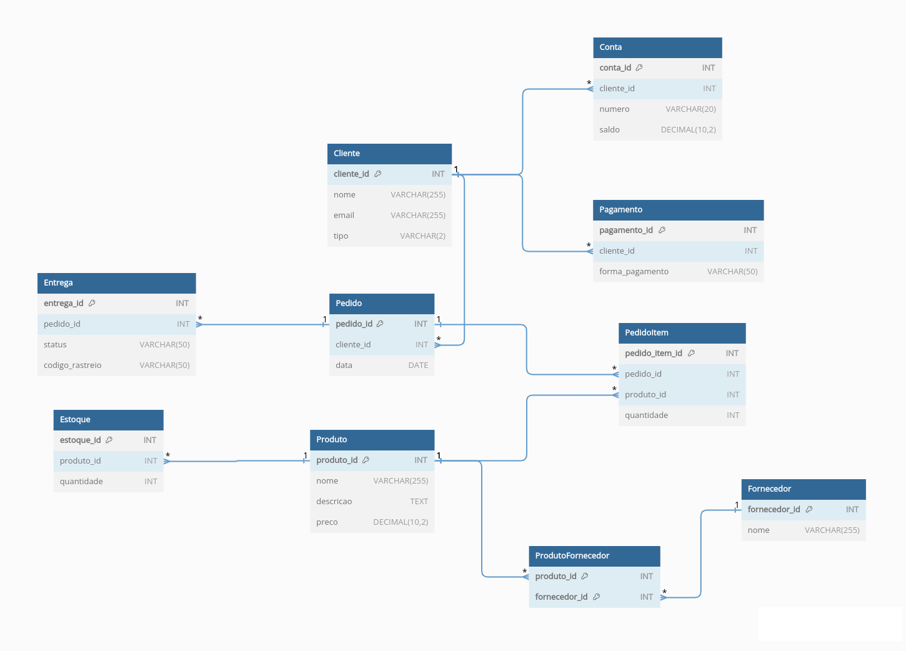

# Projeto Lógico de Modelagem de Banco de Dados

Este é o repositório que contém o projeto de modelagem de banco de dados para um sistema de e-commerce, conforme proposto no desafio do Bootcamp Potência Tech powered by iFood | Ciência de Dados da DIO. O projeto inclui a criação do esquema do banco de dados, a definição de relacionamentos, e consultas SQL para testar diferentes cenários.

## Sobre o Projeto

Este projeto tem como objetivo aplicar os conceitos de modelagem de banco de dados em um cenário de e-commerce. A modelagem considera diferentes entidades como Cliente, Conta, Pagamento, Produto, Estoque, Fornecedor, Pedido, PedidoItem e Entrega, bem como os relacionamentos entre elas.

## Diagrama de Relacionamentos

A seguir, apresentamos o diagrama de relacionamentos das tabelas do banco de dados:

## Funcionalidades Implementadas

-   Modelagem lógica das tabelas conforme especificações do desafio.
-   Definição de chaves primárias e estrangeiras para estabelecer os relacionamentos.
-   Criação do script SQL para criar o esquema do banco de dados.
-   Implementação de queries SQL para diferentes tipos de consultas, incluindo recuperações simples, filtros, expressões, ordenações, condições de grupo e junções entre tabelas.

## Como Utilizar

1.  Clone este repositório para sua máquina local usando o seguinte comando:
    

    
    `git clone https://github.com/SEU_USUARIO/nome-do-repositorio.git` 
    
2.  Execute o script SQL `create_tables.sql` em um sistema de gerenciamento de banco de dados compatível para criar o esquema do banco de dados.
    
3.  Utilize as queries SQL disponíveis em `queries.sql` para testar diferentes tipos de consultas no banco de dados criado.
    
4.  Personalize as consultas ou adicione novas conforme necessário para explorar os dados e responder às perguntas propostas.
    

## Perguntas de Análise

As seguintes perguntas foram exploradas através das consultas SQL no projeto:

-   Quantos pedidos foram feitos por cada cliente?
-   Existe algum vendedor que também é fornecedor?
-   Quais são os produtos, seus fornecedores e quantidades em estoque?
-   Qual é a relação entre os nomes dos fornecedores e dos produtos?

## Contribuição

Contribuições são bem-vindas! Se você identificar melhorias nas consultas, otimizações no esquema do banco de dados ou correções, sinta-se à vontade para abrir uma issue ou um pull request.

## Contato

Para mais informações, entre em contato via email: [barbarasouza.dev@gmail.com](mailto:barbarasouza.dev@gmail.com).